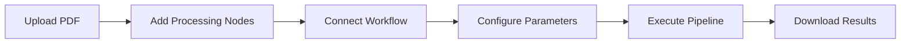

# 📄 PDF Board - Visual PDF Processing Platform

<div align="center">
  
  
  [](https://reactjs.org/)
  [](https://www.typescriptlang.org/)
  [](https://pdf-lib.js.org/)
  [](https://reactflow.dev/)
  [](LICENSE)
</div>

## 🚀 Solution Overview

PDF Board is an innovative visual PDF processing platform that revolutionizes how users interact with PDF documents. Built as a node-based visual editor, it allows users to create complex PDF workflows through an intuitive drag-and-drop interface, eliminating the need for technical expertise in PDF manipulation.

### Key Features
- **Visual Workflow Builder**: Drag-and-drop interface for creating PDF processing pipelines
- **Real-time Preview**: Instant visualization of PDF modifications
- **Batch Processing**: Handle multiple files simultaneously
- **Advanced Operations**: Merge, split, rotate, watermark, encrypt, and more
- **Cross-platform Compatibility**: Works on all modern browsers
- **No Server Required**: Client-side processing ensures data privacy

## 🛠️ Tech Stack

### Frontend Framework


### Core Libraries
- **React Flow 11.10.1**: Node-based visual editor
- **PDF-lib 1.17.1**: PDF manipulation and generation
- **PDF.js 3.11.174**: PDF rendering and text extraction
- **Zustand 4.4.1**: State management
- **Tailwind CSS**: Styling framework
- **Radix UI**: Accessible component primitives

### Development Tools
- **Vite**: Build tool and development server
- **TypeScript**: Type safety and developer experience
- **ESLint**: Code quality and consistency

## 🏗️ System Architecture


## 📋 Feature Methodology

### 1. PDF Input/Output System


**Implementation**: 
- Drag-and-drop file handling with multi-file support
- ArrayBuffer-based file storage for memory efficiency
- Real-time PDF parsing and metadata extraction

### 2. Visual Workflow Engine


**Implementation**:
- ReactFlow-based canvas with custom node types
- Type-safe connection validation between nodes
- Automatic edge splitting for workflow optimization

### 3. PDF Processing Pipeline


### 4. Real-time Preview System


## 🎯 Use Cases

### 1. **Document Management**
- **Scenario**: Office workers managing multiple PDF reports
- **Solution**: Batch merge quarterly reports, add page numbers, and apply company watermarks
- **Benefit**: Reduces manual work from hours to minutes

### 2. **Educational Content Creation**
- **Scenario**: Teachers preparing course materials
- **Solution**: Split textbooks into chapters, remove blank pages, and add custom headers
- **Benefit**: Creates organized, student-friendly materials

### 3. **Legal Document Processing**
- **Scenario**: Law firms handling case documents
- **Solution**: Merge evidence files, encrypt sensitive documents, and extract text for analysis
- **Benefit**: Ensures document security and organization

### 4. **Publishing Workflows**
- **Scenario**: Publishers preparing manuscripts
- **Solution**: Convert images to PDFs, merge chapters, and apply consistent formatting
- **Benefit**: Streamlines publication pipeline

### 5. **Digital Archive Management**
- **Scenario**: Libraries digitizing historical documents
- **Solution**: Remove blank pages, enhance image quality, and add metadata
- **Benefit**: Creates searchable, organized digital archives

## 🌍 Social Impact

### Accessibility & Inclusion


### Key Benefits:
- **Democratizes PDF Processing**: Makes advanced PDF operations accessible to non-technical users
- **Reduces Digital Divide**: Browser-based solution works on any device with internet access
- **Environmental Impact**: Promotes paperless workflows and reduces printing needs
- **Educational Empowerment**: Helps educators and students create better learning materials
- **Small Business Support**: Provides enterprise-level PDF tools without licensing costs

## 🔮 Future Scope

### Phase 1: Enhanced Processing (Q2 2024)


### Planned Features:

#### 🤖 AI Integration
- **Smart Document Analysis**: Automatic content categorization and tagging
- **Intelligent Cropping**: AI-powered page boundary detection
- **Content Extraction**: Advanced text and table recognition
- **Quality Enhancement**: Automatic image optimization and noise reduction

#### ☁️ Cloud & Collaboration
- **Real-time Collaboration**: Multiple users working on same workflow
- **Cloud Storage Integration**: Direct integration with Google Drive, Dropbox, OneDrive
- **Version Control**: Track changes and maintain document history
- **Team Workspaces**: Shared environments for organizations

#### 📱 Mobile & Accessibility
- **Progressive Web App**: Full mobile experience with offline capabilities
- **Voice Commands**: Accessibility features for visually impaired users
- **Gesture Controls**: Touch-optimized interface for tablets
- **Multi-language Support**: Localization for global accessibility

#### 🏢 Enterprise Features
- **API Gateway**: RESTful API for system integration
- **Single Sign-On**: Enterprise authentication support
- **Audit Trails**: Comprehensive logging and compliance features
- **Custom Branding**: White-label solutions for organizations

#### 🔌 Extensibility
- **Plugin Architecture**: Third-party node development framework
- **Custom Workflows**: Template marketplace for common use cases
- **Webhook Integration**: Connect with external services and automation tools
- **Advanced Analytics**: Usage metrics and performance optimization

### Technical Roadmap

#### Performance Optimization
- **WebAssembly Integration**: Faster PDF processing with WASM modules
- **Worker Threads**: Background processing for large files
- **Streaming Processing**: Handle large documents without memory constraints
- **Caching System**: Intelligent preview caching for better UX

#### Security Enhancements
- **End-to-End Encryption**: Client-side encryption for sensitive documents
- **Digital Signatures**: PDF signing and verification capabilities
- **Compliance Tools**: GDPR, HIPAA, and SOX compliance features
- **Audit Logging**: Comprehensive security event tracking

## 🚀 Getting Started

### Prerequisites
- Node.js 16+ 
- Modern web browser with ES2020 support

### Installation

1. **Clone the repository**
   ```bash
   git clone https://github.com/your-username/pdfboard.git
   cd pdfboard
   ```

2. **Install dependencies**
   ```bash
   npm install
   ```

3. **Set up environment**
   ```bash
   cp .env.example .env.local
   # Add your Gemini API key to .env.local
   ```

4. **Start development server**
   ```bash
   npm run dev
   ```

5. **Open in browser**
   ```
   http://localhost:5173
   ```

### Usage Flow


## 📊 Performance Metrics

### Processing Capabilities
- **File Size Limit**: Up to 100MB per PDF (browser dependent)
- **Concurrent Operations**: 5 simultaneous processing tasks
- **Processing Speed**: ~2MB/second for standard operations
- **Memory Usage**: Optimized for 4GB RAM systems

### Browser Compatibility
| Browser | Version | Support Level |
|---------|---------|---------------|
| Chrome  | 90+     | Full ✅       |
| Firefox | 88+     | Full ✅       |
| Safari  | 14+     | Full ✅       |
| Edge    | 90+     | Full ✅       |

## 🤝 Contributing

We welcome contributions! Please see our [Contributing Guide](CONTRIBUTING.md) for details.

### Development Setup
```bash
# Fork the repository
git clone https://github.com/your-username/pdfboard.git

# Create feature branch
git checkout -b feature/amazing-feature

# Make changes and commit
git commit -m "Add amazing feature"

# Push to branch
git push origin feature/amazing-feature

# Open Pull Request
```

## 📄 License

This project is licensed under the MIT License - see the [LICENSE](LICENSE) file for details.

## 🙏 Acknowledgments

- **PDF-lib**: Excellent PDF manipulation library
- **ReactFlow**: Powerful node-based editor framework
- **PDF.js**: Mozilla's PDF rendering engine
- **Radix UI**: Accessible component primitives
- **Tailwind CSS**: Utility-first CSS framework

## 📞 Support

- **Documentation**: [docs.pdfboard.app](https://docs.pdfboard.app)
- **Issues**: [GitHub Issues](https://github.com/your-username/pdfboard/issues)
- **Discussions**: [GitHub Discussions](https://github.com/your-username/pdfboard/discussions)
- **Email**: support@pdfboard.app

---

<div align="center">
  <p>Made with ❤️ for the PDF processing community</p>
  <p>
    <a href="https://github.com/your-username/pdfboard">⭐ Star us on GitHub</a> |
    <a href="https://twitter.com/pdfboard">🐦 Follow on Twitter</a> |
    <a href="https://linkedin.com/company/pdfboard">💼 Connect on LinkedIn</a>
  </p>
</div>